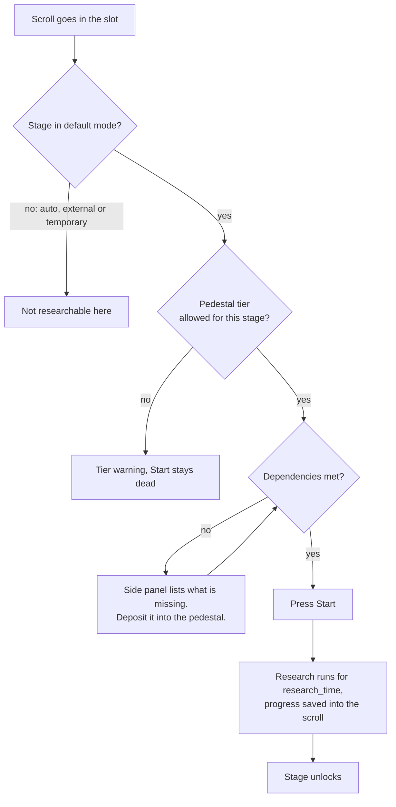

# Research Pedestal

The pedestal is where progression actually happens. A player puts a
[Research Scroll](/wiki/in-game-tools/research/scrolls) into it, the research runs for the stage's
`research_time`, and the stage unlocks when it finishes.


While research is running the pedestal emits light (level 13) and shows progress in its GUI.
**Progress is stored in the scroll itself**, not in the block, so a player can take the scroll out,
walk away, and carry on later — or finish at a different pedestal entirely.



## Starting and pausing

Research does not begin on its own. A scroll sitting in a pedestal with everything in order still
waits for the **Start** button; while a run is going the same button reads **Pause**, and pausing is
always allowed.

Nothing is lost by a pause, an interruption or an unmet condition. Progress is kept and the run
simply stops advancing — that is also what happens if a dependency stops being met halfway, or if
the scroll is moved to a pedestal of the wrong tier.

## Handing in dependencies

When a stage has [dependencies](/wiki/stage-file/dependencies), the pedestal GUI expands to show a
side panel listing every condition and whether it is met. Deposit-based conditions — items, item
tags, XP levels — are fulfilled by putting them straight into the pedestal, a few at a time if need
be. The counter on each entry shows how far along it is.

## Tiers

There are four pedestals, so a pack can put late-game research behind a more elaborate setup:

| Tier | Block id | |
| :--- | :--- | :--- |
| I | `historystages:research_pedestal` | Single block. |
| II | `historystages:research_pedestal_tier_2` | Single block. |
| III | `historystages:research_pedestal_tier_3` | Wider, multi-block. |
| IV | `historystages:research_pedestal_tier_4` | The largest. |

Each tier is its own block. A higher tier does not require dismantling a lower one — they are
separate placements, and the pedestal a scroll sits in decides both the tier gate and which
[boosters](#boosters) count.

### Tier gating per stage

Two optional fields in the stage file restrict where it may be researched:

| Field | Type | Default | |
| :--- | :--- | :--- | :--- |
| `min_pedestal_tier` | Integer 1–4 | `1` | The lowest tier that may research this stage. |
| `pedestal_tier_mode` | String | `"min"` | `"min"` — this tier and higher. `"exact"` — only this tier. |

A scroll placed in a pedestal that does not match gets a tier-mismatch warning in the GUI, and
research simply does not start.

Whether players can see the requirement before trying is `showScrollTierTooltip` in
[`[visuals]`](/wiki/server/config-files/visual-toml#visuals), on by default.

## Boosters

A booster is an ordinary block placed **directly underneath** an active pedestal. It changes the
research running on top of it in two ways:

- **Speed reduction** shortens the research time. Capped at 90%, so research can run at most 10×
  faster.
- **Cost reduction** lowers the count on item-deposit dependencies. It is **locked into the scroll
  on the first deposit**, so it cannot be gamed by swapping boosters halfway through.

Boosters are declared in
[`researchBoosters`](/wiki/server/config-files/gameplay-toml#research), one comma-separated string
per entry:

```text
"block_id, speed_percent, cost_percent, tier, mode"
```

| Part | Values |
| :--- | :--- |
| `speed_percent` / `cost_percent` | 0–90. |
| `tier` | The lowest pedestal tier the booster works under, 1–4. |
| `mode` | `min` (this tier and higher) or `exact` (only this tier). |

```toml
researchBoosters = [
    "minecraft:redstone_block, 25, 0, 1, min",
    "minecraft:diamond_block, 50, 25, 2, min",
    "minecraft:beacon, 75, 50, 4, exact"
]
```

The list is also editable in-game through the
[Config Editor](/wiki/in-game-tools/in-game-editor), so booster blocks and their tier requirements
can be set up without touching the file.

### Which block gets checked

Tier I and II pedestals check **the single block directly underneath**.

Tier III and IV are multi-block structures, so the mod scans **both** positions beneath them — the
foot block and the head block — and applies only the **strongest** match. Speed reduction wins;
cost reduction breaks a tie; the foot block wins a complete tie. A booster whose `tier` / `mode`
does not match the pedestal it is under is ignored entirely rather than partially applied.

Boosters are registered as their own JEI/EMI recipe category, so players can look up which blocks
help and by how much. The hover text on the block itself is `showBoosterTooltips` in
[`[visuals]`](/wiki/server/config-files/visual-toml#visuals).

## Comparator output

The pedestal drives a comparator, so redstone can react to research:

| Signal | Meaning |
| :--- | :--- |
| `0` | No scroll, or research has not started. |
| `1`–`14` | In progress, scaling linearly. |
| `15` | Complete. |

The signal jumps to `1` the moment research begins and rises continuously to `15`. That is enough to
drive a progress display, trigger a sound, or hold a door shut until research finishes.

On Tier III and IV pedestals, the foot block and the head block emit the same signal.

## Getting pedestals into the pack

There are no recipes for the pedestals by default. →
[Obtaining Scrolls & Pedestals](/wiki/in-game-tools/research/obtaining)

## See also

- [Research Scrolls](/wiki/in-game-tools/research/scrolls) — the item that goes in the pedestal.
- [Dependencies](/wiki/stage-file/dependencies) — what the side panel is listing.
- [Stage Modes](/wiki/stage-file/stage-modes) — the modes that skip the pedestal entirely.
