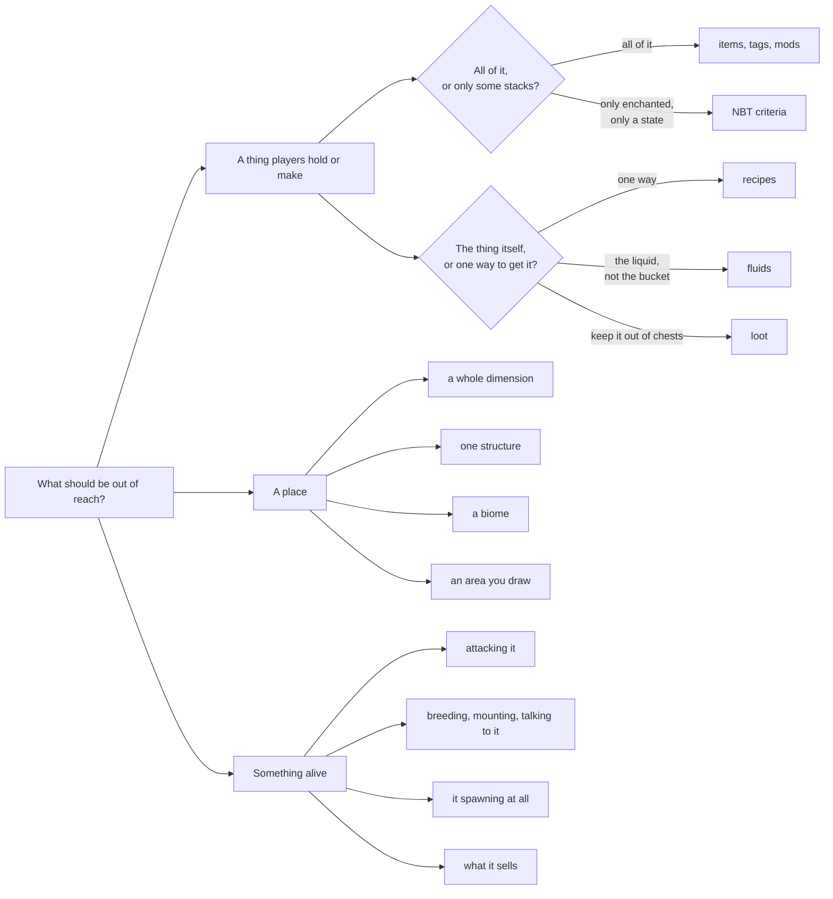

# What You Can Lock

A stage holds a list per kind of content. The kind decides which field the entry goes in, which
scope it works in, and what a player runs into when they try anyway — but the shape is always the
same: a list on a stage, and everything in it is out of reach until the stage opens.

## Start from what you want to stop

Every one of those can also be narrowed to single interactions rather than all of them — carry the
sword but do not swing it, craft the ingot but do not wear the armour. →
[Unlock Actions](/wiki/locking/items-and-recipes/unlock-actions)

## The pages

### Items & Recipes

| | |
| :--- | :--- |
| [Items, Tags & Mods](/wiki/locking/items-and-recipes/items-tags-mods) | One id, a whole item tag, or every item a mod adds — and exceptions carved back out. |
| [NBT & Data Components](/wiki/locking/items-and-recipes/nbt-and-components) | Only the stacks that match: the enchanted book with Sharpness, the potion with one effect. |
| [Unlock Actions](/wiki/locking/items-and-recipes/unlock-actions) | Gate one interaction instead of all of them. |
| [Recipes](/wiki/locking/items-and-recipes/recipes) | Named recipe ids, when only one route to an item should close. |
| [Fluids](/wiki/locking/items-and-recipes/fluids) | The fluid itself, which covers every bucket and tank item in the pack. |
| [Loot](/wiki/locking/items-and-recipes/loot) | Chest loot and mob drops, filtered per player. |

### The World

| | |
| :--- | :--- |
| [Dimensions & Structures](/wiki/locking/world/dimensions-and-structures) | Refuse entry, wall a structure off, or cap how often it generates. |
| [Biomes](/wiki/locking/world/biomes) | Make the place unsurvivable rather than unreachable. |
| [Zones](/wiki/locking/world/zones) | Areas you draw yourself, each with its own rules. **Beta.** |

### Creatures & Trade

| | |
| :--- | :--- |
| [Entities & Spawns](/wiki/locking/creatures-and-trade/entities-and-spawns) | Attacking, interacting, and whether the thing spawns at all. |
| [Merchant Trades](/wiki/locking/creatures-and-trade/merchant-trades) | One offer, a whole profession, or a merchant level. |

## Two things worth knowing before you pick

**Scope decides more than you would expect.** Some kinds only work server-wide and some only
per-player; a lock written into the wrong kind of stage is skipped silently and reported in the load
report. The full table is on
[Global vs Individual Stages](/wiki/start-here/global-vs-individual#what-can-each-one-lock).

**The editor is the normal way to write all of this.** Every page names the tab it lives on and what
its right-click menu offers, because that is where a pack is actually built. →
[In-Game Editor](/wiki/in-game-tools/in-game-editor)
