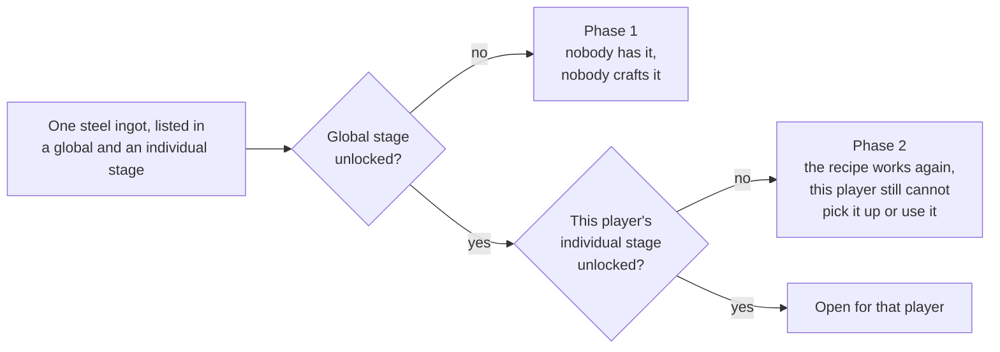

# Global vs Individual Stages

History Stages has two progression models: **Global** (server-wide) and **Individual**
(per-player). Both can run side by side in the same modpack, but they lock different things and
behave differently for the player. Which one a stage is depends only on
[which folder its file sits in](/wiki/start-here/where-stage-files-live).

## What can each one lock?

Not every lock type works in both modes. Pick the wrong stage type and your lock is silently
ignored — you will only see it in `debug-*.log`.

| Lock type | Global | Individual |
|---|:---:|:---:|
| [Items / blocks](/wiki/locking/items-and-recipes/items-tags-mods) (use, attack, equip, pickup, place, break, gui) | yes | yes |
| [Tags](/wiki/locking/items-and-recipes/items-tags-mods#tags) | yes | yes |
| [Mods](/wiki/locking/items-and-recipes/items-tags-mods#mods) (incl. `mod_exceptions`) | yes | yes |
| [NBT items](/wiki/locking/items-and-recipes/nbt-and-components) | yes | yes |
| [Fluids](/wiki/locking/items-and-recipes/fluids) (what a bucket or tank is carrying) | yes | yes |
| [Recipes](/wiki/locking/items-and-recipes/recipes) | yes | yes, at manned stations |
| [Loot tables](/wiki/locking/items-and-recipes/loot) (replace/remove in chests and drops) | yes | yes |
| [Dimensions](/wiki/locking/world/dimensions-and-structures) | yes | yes |
| [Structures](/wiki/locking/world/dimensions-and-structures) | yes | yes |
| [Structure generation caps](/wiki/locking/world/dimensions-and-structures#generation-limits) (`block_generation`) | yes | **no** |
| [Biomes](/wiki/locking/world/biomes) | yes | yes |
| [Zones](/wiki/locking/world/zones) (areas you draw yourself) | yes | yes, except "no mob spawns" |
| [`attacklock`](/wiki/locking/creatures-and-trade/entities-and-spawns#attacklock) (player cannot attack the mob) | yes | yes |
| [`interactionlock`](/wiki/locking/creatures-and-trade/entities-and-spawns#interactionlock) (breed/mount/trade/leash/…) | yes | yes |
| [`spawnlock`](/wiki/locking/creatures-and-trade/entities-and-spawns#spawnlock) (mob does not spawn at all) | yes | **no** |
| [Merchant offers](/wiki/locking/creatures-and-trade/merchant-trades) (`trades` → `offers`) | yes | yes |
| [Merchant professions and levels](/wiki/locking/creatures-and-trade/merchant-trades) | yes | yes |
| Enchantments | yes | yes |
| [`lose_on_death`](#lose-on-death) | **no** | yes |

**Why three of them are one-sided.** `spawnlock` is a world-global mechanic: a mob spawn does not
know who it is appearing for, and an individual lock needs a concrete player ("this player just
tried to use this item"). A zone's **no mob spawns** switch is the same question in a different
place and is likewise global-only; everything else a zone does has a player standing in it and works
in both. `block_generation` is the same class of reason — world generation happens once,
permanently, for the whole world, so there is no per-player chunk to gate. `lose_on_death` is the
mirror case: there is no single player whose death should relock a stage shared by the whole server.

Fluids work in both, because a fluid is only ever asked about with a player at hand. The one place
that breaks down is the recipe side of a fluid lock on an individual stage: it reaches only the
stations that know who is crafting, exactly as `recipes` does.

## How the player experiences it

### Global and Individual lock at different layers

This is the part that trips most people up. Listing the same item in a global stage and in an
individual stage does very different things.

**Global stage: the recipe goes away.**

While the stage is locked, every recipe whose output is the locked item is filtered out of the
`RecipeManager`. That covers every recipe type the game has:

- Crafting table and crafter
- Furnace, smoker, blast furnace, campfire
- Stonecutter, smithing table
- Brewing stand
- Custom recipe types from KubeJS, CraftTweaker, and other mods

The item cannot be produced. No one on the server can craft it. JEI and EMI show a lock overlay, or
hide the recipe entirely if `hideLockedItemsInJei` or `hideLockedRecipesInJei` is on. The `recipes`
field works as a more surgical tool on top of this, removing specific recipe ids by hand when you
only want one of several variants gone.

One exception: an item entry can leave `recipe` out of the lock. `unlock_actions` lists the actions
that stay **free**, so `"unlock_actions": ["recipe"]` keeps the recipe craftable while everything
else about the item stays gated. → [Unlock Actions](/wiki/locking/items-and-recipes/unlock-actions).

**Individual stage: the item refuses to land in the inventory.**

The recipe stays in the registry. Any unlocked player can craft it like normal. For a locked player,
several mechanics work together so the item never actually ends up in their inventory:

- Picking it up off the ground is blocked.
- Clicking it in any slot of any container — chest, crafting table output, anywhere — is cancelled
  as soon as the locked player tries to grab it.
- On login, the server scans the player's inventory and drops any stack whose `pickup` action is now
  locked for them. This is how the system catches items that became locked while the player was
  offline.
- The regular action locks (use, equip, place, …) still apply if the item somehow lands in their
  hand anyway, for example through `/give` from an operator.

So the recipe still exists, but a locked player cannot have the item. An unlocked player can stand
at the same crafting table and produce it without anything stopping them. Only the locked player is
shut out.

The pickup block can be turned off with `lockItemPickup` in `[individual_stages]` (default on); the
container click block is a separate switch, `lockContainerInteraction`. →
[gameplay.toml](/wiki/server/config-files/gameplay-toml#individual_stages).

### Per-player recipe locks, and where they stop

Since 6.0 the `recipes` field also works inside an individual stage, and so does an item entry whose
`recipe` action is locked. Both are gated per player at the stations that know who is standing at
them:

- Crafting table
- The 2×2 grid in the player's own inventory
- Stonecutter
- Smithing table

At those four, an individual stage does exactly what a global one does: the result slot stays empty,
and for the stonecutter the locked recipe is not even offered as a button. Two players can stand at
the same crafting table and get different results.

**Everywhere else it stays global-only**, because there is no player to ask:

- Furnace, blast furnace, smoker, campfire
- Brewing stand
- The crafter block, hopper feeds, and mod autocrafters
- Any mod station with its own menu whose recipe type has not been registered as per-player-gateable

**Another mod can add to that list.** Since 6.0.0 a mod may declare one of its own recipe types
per-player-gateable, and the editor then offers it like the built-in three. That is a promise about
the mod's own station — that a player is standing at it and that our hooks see them — so the list
above is the vanilla floor rather than the whole of it. → [Addon
Development](/api/addon-development).

:::warning
**A recipe locked by an individual stage can still be produced in an autocrafter.** That is
acceptable for progression design — a professions system, a research tree — and it is not cheat
protection. If something has to be genuinely unobtainable, use a global stage.
:::

Anvil, loom and cartography table are absent from both lists: they are not recipe-driven in the
first place. Vanilla has exactly seven recipe types, and those three stations use none of them, so
there is no recipe id to write into a stage.

The switch for all of this is `lockRecipes` in `[individual_stages]`, on by default. → [Recipes](/wiki/locking/items-and-recipes/recipes)
has the whole picture.

### Mob spawns (Global only)

`entities.spawnlock` stops a mob from appearing in the world at all. That is a world-global
decision, so per-player does not make sense for it. It exists only for global stages.

`attacklock` is the individual-friendly version. The mob spawns normally and unlocked players can
attack it, but for a locked player every attack is cancelled.

### Items, blocks, dimensions, structures

The lock mechanism is the same in both modes. What changes is who the lock applies to.

- **Global:** once unlocked, the content is free for every player on the server. New joiners walk
  into the already-unlocked state.
- **Individual:** every player has to unlock the stage themselves. New joiners start with nothing,
  regardless of what other players have done.

This is why player A can be wandering through the End while player B is still scraping by in the
Stone Age. Normal for individual stages, impossible for global ones.

### Which dependencies each one can use

A stage can demand conditions before it may be researched, and which kinds are available depends on
the stage type. The split is not arbitrary: a per-player condition needs a clearly defined
researcher. An individual scroll has a fixed owner from the moment research starts. A global scroll
has no owner.

**Both stage types** can demand items and item tags at the pedestal, another global stage, an
individual stage held collectively, and a scoreboard objective.

**Individual stages** add four that need a specific player: advancements, XP level, entity kill
counts, and tracked statistics. Written into a global stage by hand they are not stripped out — the
checker simply skips them rather than measuring them against whoever last opened the pedestal.

→ [Dependencies](/wiki/stage-file/dependencies) has every condition, the AND/OR rules, and the
`individual_stages` modes.

## Lose on Death

An individual stage can relock itself when its owner dies:

```json
{ "lose_on_death": true }
```

Global stages cannot use it — there is no single player whose death should relock a stage the whole
server shares. The field is omitted entirely rather than written as `false` when it is off.

The relock happens **on death itself, not on respawn**, so the stage's newly re-locked items are
included in the player's death drops. Combined with `keepInventory`, this makes specific progression
items the only thing a player risks losing on death.

If the stage is in [`temporary`](/wiki/stage-file/stage-modes#temporary) mode with a running timer,
dying ends that timer early and starts the cooldown as if it had expired naturally, without counting
against `max_triggers` any differently than a normal expiry.

## Dual-Phase: when both lists target the same content

If the same entry appears in a global stage and in an individual stage, History Stages turns on the
**Dual-Phase Lock** for it automatically. Every category takes part except two: `mod_exceptions`,
which carves holes rather than locking, and `spawnlock`, which has no individual side to overlap
with. So items, fluids, tags, mods, recipes, dimensions, structures, biomes, zones, attack and
interaction locks, and all three trade categories are covered.

1. **Phase 1 (Global):** locked for everyone until the global stage is unlocked server-wide. The
   recipe is also blocked during this phase, as above.
2. **Phase 2 (Individual):** once the global unlock happens, the recipe becomes craftable again, but
   each player still cannot use or pick up the item until they unlock their individual stage
   themselves.



Dual-phase entries get a `[Dual]` badge in the in-game editor and their own lock icon in the
player's inventory.

## Pitfalls

- **Ids must be unique within a tree, not across the two.** Two files called `iron_age.json` in
  different subfolders of `global/` collide — the alphabetically first path is kept, the other is
  skipped with an error in the debug log. The same id in `global/` *and* `individual/` is fine, and
  is how a dual-phase lock is written.
- **Recipe locks in an individual stage reach only manned stations** — four in vanilla, more if a
  mod registers its own. A furnace or an autocrafter ignores them. Before 6.0 they were stripped out
  at load time entirely; they are now kept.
- **An individual item lock does not touch the recipe.** Other players can craft the item right next
  to a locked player without anything happening. The lock only bites when the locked player tries to
  obtain or use it.
- **Individual unlocks are not retroactive.** `/history individual unlock @a stage_x` reaches only
  players online at that moment. Anyone joining later has to be unlocked separately, or clear the
  dependency chain themselves.
- **`/history reload` does not change unlock state.** It only re-reads definitions. Rename a stage
  and every unlock on the old id is gone.
